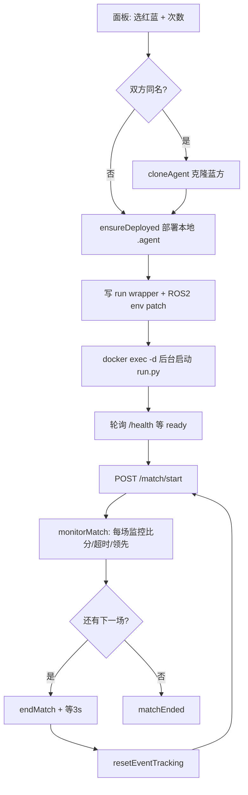
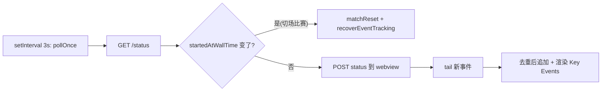

# Booster Match Runner — 内部参考（喂给 AI 的上下文）

> 这份文档面向**二次开发、改 bug、让 AI 帮你定制功能**。它把当前代码里所有与 Booster 仿真环境相关的硬编码事实（镜像、路径、命令、HTTP API、设计原理）集中列出来，方便你直接复制给 AI 作为有效上下文。
>
> 配套：[README](../README.zh-CN.md) · 源码在 `src/`。

---

## 1. Docker 镜像与容器

| 项 | 值 | 出处 |
|---|---|---|
| 仿真镜像（默认） | `booster-robotics-registry.cn-beijing.cr.aliyuncs.com/virtual-robot/virtual-robot:0.6.5-beta` | `package.json` → `boosterMatch.simImage` |
| Game Control 端口 | `38383`（容器内） | `boosterMatch.gameControlPort` |
| 容器定位方式 | 显式 `containerName` > 按 `simImage` 自动 `docker ps --filter ancestor=<image>` 取第一个 > 缓存 | `src/docker.ts` `resolveContainer()` |
| 启动容器 | `docker start <name>` | `startSimContainer()` |

> **关键点**：HTTP API 跑在**容器内** `127.0.0.1:38383`，宿主机访问不到。本插件所有 API 调用都是 `docker exec <container> bash -c "curl ..."` 走容器内部 curl。

---

## 2. 容器内关键路径（硬编码）

> ⚠️ **这些路径与 38383 API 都是 Booster Studio「运行」按钮注入的运行时产物，并非镜像自带。** 容器刚创建或被删除重建后，它们都不存在，插件会卡在 `Health not ready` / `Runner not ready in 75s`。必须先在 Booster Studio 里点一次「运行」按钮部署 3v3 比赛栈（见 README「首次使用」）。诊断「插件不工作」时，第一步永远是确认 `/usr/local/booster_agent/football3v3_runner/run.py` 存在、`ss -tlnp | grep 38383` 有监听。

```
# 仿真 events 日志（事件流来源）
/usr/local/booster_robot/booster_robocup_sim/logs/game-control/events.jsonl

# 3v3 runner 目录与日志
/usr/local/booster_agent/football3v3_runner/
/usr/local/booster_agent/football3v3_runner/football3v3-run.log

# agent 解压/部署根目录
/opt/booster/booster_agent_data/data/agents/extract/<agentId>/

# ROS2 环境注入点（login shell 会 source）
/etc/profile.d/ros_env.sh
```

出处：`src/matchRunnerProvider.ts` (`EVENTS_LOG_PATH`)、`src/docker.ts` (`extractRoot`)、`src/agentManager.ts` (`CONTAINER_AGENT_ROOT`)。

---

## 3. Game Control HTTP API（容器内 `127.0.0.1:38383`）

| 方法 | 路径 | 用途 | 返回字段（节选） |
|---|---|---|---|
| `GET` | `/status` | 比赛状态 | `match.{score, durationSeconds, isFinal, startedAtWallTime, endedAtWallTime}`、`game.{state, phase}` |
| `POST` | `/match/start` | 开始比赛 | — |
| `POST` | `/match/end` | 结束比赛 | — |
| `GET` | `/health` | runner 健康检查 | `{ready, checks:{team1, team2}}` |

调用封装：`src/docker.ts` `gameControlApi(path, method, timeout)`；语义映射见 `src/matchRunner.ts`。

`state` 取值：`playing | ready | set | finished`（见 `src/types.ts`、i18n 状态字典）。

---

## 4. 3v3 Runner 启动命令

```bash
cd /usr/local/booster_agent/football3v3_runner
exec python3 run.py --publish-logs --teams <team1Id> <team2Id>
```

- 通过写一个临时 wrapper `/tmp/_run3v3.sh`，再用 `docker exec -d`（后台）启动。
- 启动后轮询 `/health`，最多 15 次 × 5s（75s）等 `ready && team1 && team2`。

### ROS2 环境注入（踩坑修复，别删）
pyagent 需要 BoosterAgent 的 `setup.bash`，但 `setup.bash` 加载约 3s，而 `ros_env.sh` 被**每个 login shell** source，会导致 sandbox 初始化超时（机器人不动）。

修复思路（`restartRunnerWithTeams` 里）：
1. 把 `setup.bash` **一次性** source，解析出完整 env；
2. 把它写成**纯 `export` 行**追加回 `ros_env.sh`（login shell 仍 ~10ms）；
3. 幂等：重跑前先 grep 剥离旧 patch 块。

> 改 runner 启动逻辑前，务必读 `src/matchRunnerProvider.ts` `restartRunnerWithTeams()` 的注释——这里有真实的「机器人不动」根因。

---

## 5. 事件增量读取原理

events.jsonl 每行一个 JSON：`{ eventId, wallTime, type, actor:{side,teamName}, score:{home,away}, ... }`。

- **基线**：比赛开始时 `wc -l < events.jsonl` 记录行数作为 baseline。
- **增量**：`tail -n +<baseline+1> events.jsonl` 读新行，`src/eventReader.ts` 解析。
- **过滤**：只保留 `KEY_EVENTS`（进球/犯规/定位球/比赛开始结束等），噪声类型（ball_touch/state_changed 等）被丢弃。
- **重载恢复**：用 `grep '"type":"match_started"' | tail -1` 定位最近一场的起点，重建 baseline。
- **合成事件**：比赛结束追加一个本地 `match_finished` 事件（不管手动/自动/外部结束）。

轮询节奏：独立 `setInterval(3s)`（`pollOnce`）负责状态+事件 UI；`monitorMatch` 只管自动结束逻辑。两者解耦，所以窗口重载后 UI 仍能恢复。

---

## 6. Agent 发现 / 部署 / 克隆

**发现**（`src/agentManager.ts`）：
- 容器内：`ls /opt/booster/.../extract` → 每个目录是一个 agent（id = 目录名）。
- 宿主机：扫描 `hostAgentRoots`（深入一层工程目录 + 根目录下的 `.agent`）。
- `.agent` 是 zip，读其中 `agent.json` 的 `id`（**id 必须与解压目录名一致**，否则 `run.py` 找不到）。

**部署 `.agent`**（`deployAgentFile`）：
`docker cp` 到容器 → python `zipfile` 解压（容器无 unzip）→ 读 `agent.json.id` → 拷到 `extract/<id>/`。

**同名 agent 克隆**（`cloneAgent`）：双方选了同一个 agent 时，ROS2 包名会冲突。克隆蓝方：
1. `cp -a` 复制 extract 目录到 `<id>.blue`；
2. 改 `agent.json` 的 `id` + `ros2.package_name`；
3. 改 `agent/<pkg>/lib|share/<pkg>` 目录名；
4. 改 `package.xml`、`launch.py`、`ament_index`、`colcon-core` 资源名。

---

## 7. 设计原理图

### 7.1 开始一场比赛（Headless 为例）



### 7.2 独立轮询循环（UI 状态 + 事件）



### 7.3 模块结构

```
extension.ts            入口，注册 view provider + 命令
matchRunnerProvider.ts  ★核心：webview、比赛编排、轮询、记录、i18n
matchRunner.ts          比赛生命周期 HTTP 调用 (start/end/status)
docker.ts               所有容器操作 + gameControlApi + agent 克隆/部署
eventReader.ts          events.jsonl 解析 + 增量读取
agentManager.ts         agent 发现（容器 + 宿主）
i18n.ts                 中英字典 + 语言状态（globalState 持久化）
types.ts                共享类型
```

webview 是 `matchRunnerProvider.getHtml()` 里一段自包含 HTML+JS 字符串；扩展通过 `postMessage` 推 `{type, ...}`，webview 收到后渲染。语言切换时扩展重推 i18n bundle，webview `applyLang()` 重译全部文本。

---

## 8. 让本地 AI 自动编译并安装到 Booster Studio（现成 prompt）

把下面整段发给你的本地 AI（Claude Code / Cursor / 其他），它会自动找路径、编译、打包、装进 Booster Studio 并提示你 reload。

```
你是 Booster Studio 插件开发助手。请在本仓库完成「编译 + 打包 + 安装到 Booster Studio」：

1. 定位 Booster Studio CLI：
   - Windows: 查找类似 C:\Program Files\BoosterStudio\bin\booster-studio.cmd 或 %LocalAppData%\Programs\... ；
     也可 `where booster-studio` / `which booster-studio`。
   - macOS/Linux: `booster-studio`。
   找到后用 `booster-studio --version` 确认可用。

2. 在仓库根目录执行：
   npm install
   npm run compile          # tsc -p ./
   npx vsce package --no-git-tag-version --allow-missing-repository

3. 安装生成的 .vsix（覆盖旧版）：
   <booster-studio CLI> --install-extension <生成的vsix绝对路径> --force

4. 提示我：在 Booster Studio 里 Ctrl+Shift+P → Developer: Reload Window。

注意：
- 只能改我明确要求的代码；改完先 `npm run compile` 确认无 TS 报错。
- booster-studio 和普通 VS Code 不是同一个程序；别装错到 `code`。
- 产物文件名取自 package.json 的 version，勿带 `+buildmetadata` 段（会导致升级判定失效）。
```

---

## 9. 常见自定义场景（给 AI 的提示）

- **改默认对手 / 端口 / 镜像** → `package.json` 的 `contributes.configuration`。
- **加新的事件类型显示** → `src/eventReader.ts` 的 `KEY_EVENTS`（英文标签自动 humanize，中文加到 `src/i18n.ts` `EVENT_LABELS.zh`）。
- **自动结束阈值**（超时秒数 / 领先球数）→ 现由面板传入，默认 `0 = 不启用`；逻辑在 `matchRunnerProvider.ts` `monitorMatch(endMatchFn, timeoutSeconds, leadGoals)`，领先判定为双向 `Math.abs(home-away) >= leadGoals`。
- **换语言/加语言** → `src/i18n.ts`（`Lang` 类型 + 字典 + webview 默认字典）。
- **改记录存储位置/格式** → `recordsDir()`、`buildMatchZip()`、`exportRecordsCsv()`。

> 任何改动后，用第 8 节的 prompt 让 AI 重新编译安装即可立即在 Booster Studio 验证。
